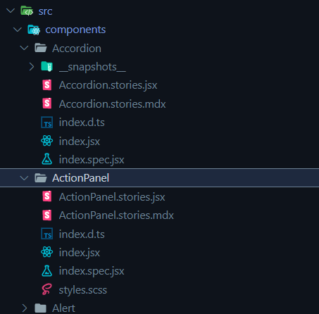

Due to some React 17 compatibility issues with our current docs setup, we made the decision to migrate our UI library docs to Storybook.
Of courses, that was just a catalyst, we'd known of the goodies Storybook had to offer for some time, like accessibility testing and a more structured setup for isolated component documentation and development.

First up, I initialized storybook in the root directory:

```sh
npx sb init
```

So far so good, the CLI command installed the required deps and set up the default config files at `./storybook`.

### Customize the Storybook Webpack config

Next, I had to adjust the Storybook Webpack config to cater for our use of `scss`. You can edit the Webpack config in `./storybook/main.js`. The `webpackFinal` option allows you to modify the Webpack config object before it's passed to Webpack.

```js title="./storybook/main.js"
const MiniCssExtractPlugin = require('mini-css-extract-plugin');
const postCssConfig = require('../config/postCssConfig');


module.exports = {
  // ...
  webpackFinal: async (config, { configType }) => {
    config.module.rules.push({
      test: /\.s(a|c)ss$/,
      use: [
        configType === 'DEVELOPMENT' ? 'style-loader' : MiniCssExtractPlugin.loader,
        {
          loader: 'css-loader',
          options: {
            importLoaders: 2,
            sourceMap: false,
          },
        },
        {
          loader: 'postcss-loader',
          options: postCssConfig,
        },
        'sass-loader',
      ],
      include: path.resolve(__dirname, '../'),
    })
    // Return the altered config
    return config;
  };
}
```

Again in the main.js file, I needed to map our existing static assets used in our docs. In our case, they're in `www/assets`. The `staticDirs` option takes an array of directories to serve static assets from.

```js title="./storybook/main.js"
module.exports = {
  // ...
  staticDirs: ["../www/assets"],
  // ...
};
```

Now files in `www/assets` are served statically, and can be referenced in `mdx` docs and stories like this:

```html
<!-- www/assets/banner.jpg -->

```

Now I was able to run `npm run storybook` and do some initial testing.

### Setting up a default docs page template

I had a look at the existing documentation files.

We have an `mdx` file per documented component. Each mdx file has a title, then a React Live example, followed by a description then the prop types table generated by `react-docgen`.

I already knew I wanted to alter the structure going forward, to put the component description at the beginning, followed by an example, then the prop types table, and any additional examples after that.

So this was the new structure:

```md
# Title

# Overview

# Example

# PropTypes

# Additional Examples
```

After a bit of testing around the [`@storybook/addon-docs`](https://storybook.js.org/addons/@storybook/addon-docs) implementation, I decided the best and most future-proof route to go was to actually create a `[component].stories.jsx` file that would hold the [`CSF3`](https://storybook.js.org/blog/component-story-format-3-0/) story, and a `[component].stories.mdx` that would hold the documentation and reference the stories.

The component descriptions were written in html, and generally quite short, so I decided I would manaully convert them to markdown which also gave me a chance to edit and fix any grammatical issues as I went.

I made two fairly crude template functions that would take in the required metadata, and spit out a functioning story/docs pair.

The new Component Story Format makes the `js(x)` part of it super simple (we reference the component itself in the `mdx` file). Although I knew not every component would function out of the box with (only) a `children` prop, it was a good starting point for most.

```js
const jsDefaultStory = () => {
  return `
    export const Default = {
      args: {
        children: 'Default',
      },
    };
  `;
};
```

The more interesting part here is the `mdx` template. Because I know my desired structure of title, Overview / example, and props table, I could create a template with comment markers for the content, and the other parts where I want them to be.

```js
const mdxDefaultStory = ({ name }) => {
  return `
    import { Meta, Story, Canvas } from '@storybook/addon-docs';
    import ${name} from './';
    import * as stories from './${name}.stories.jsx';

    <Meta title="Components/${name}" component={${name}} />

    <Overview component={${name}}>

    <!-- ${name} overview goes here -->

    <Canvas>
      <Story name="Overview" story={stories.Default} />
    </Canvas>

    </Overview>

    <!-- any extra stories go here (after the Props table) -->
  `;
};
```

What is this `Overview` component? It's a reusable `mdx` component that takes a component and children. It's not possible to automate away everything (`Meta`, default story) into this component because the docs addon is only looking in the `*.stories.mdx` file itself for the meta/stories.

```mdx title="Overview.mdx"
import { ArgsTable } from "@storybook/addon-docs";

<h1>{props.component.displayName}</h1>

## Overview

<>{props.children}</>

## Props

<ArgsTable of={props.component} />
```

You'll also notice `Overview` isn't imported in the template. That's because I have it listed as an mdx component in the docs parameters via `./storybook/preview.js`.

```js title="./storybook/preview.js" {6-8}
import Overview from "../www/storybook/Overview/index.mdx";

export const parameters = {
  // .. other params here
  docs: {
    components: {
      Overview,
    },
  },
};
```

### Putting it together

Now I had my templates set up, I was ready to create all of the stories!

Normally I would use `glob` to get the list of files in the components directory, and loop through those. Something like this:

```js
const allComponentFiles = glob.sync(`src/components/**/*[!.spec|.test].jsx`);
```

In this case I decided to do some regex on the `src/index.js` file, as this file has all of the exports of the library (I didn't want to generate stories for internal or unexported components). I know enough about our directory structure to not have to worry about any edge cases here.

The regex creates two groups, the first one being the name the component is imported as, and the second one being the import path (with the leading `.` removed).

```js title="create-stories.js" {12}
(async () => {
  const exportedFiles = await fs.readFile("src/index.js");

  // get an array of each 'import' line in the file
  const matches = exportedFiles.toString().match(/import (.*)/gm);

  // I'm just skipping a few components I'd already created stories for in testing
  const skip = ["Accordion", "ActionPanel", "Button"];

  matches.forEach(async (str) => {
    // for each import, capture the import name and directory
    const match = str.toString().match(/import (\w+) from \'\.(.*)\'/);
    // ignore anything that doesn't have a from [...] (probably imported css files)
    if (!match?.[1]) return;

    const name = match[1];
    // I know the index.js file is in src, and I'm calling this script from the root,
    // so I'm adding src/ to the relative import path
    // src/[dir]/[name]
    const p = `src${match[2]}/${name}`;

    if (skip.includes(name)) {
      return;
    }

    // src/[dir]/[name].stories.mdx
    const mdxStoryPath = `${p}.stories.mdx`;
    const mdxStory = mdxDefaultStory();
    await fs.writeFile(mdxStoryPath, mdxStory);

    // src/[dir]/[name].stories.jsx
    const jsStoryPath = `${p}.stories.jsx`;
    const jsStory = jsDefaultStory({ name });
    await fs.writeFile(jsStoryPath, jsStory);
  });
})();
```

I ran the script

```sh
  node generate-stories.js
```

And all of the story templates were created:



<br />
<br />


### Taking it further

Once the existing component stories are all filled out, I'd recommend checking out [plop.js](https://plopjs.com/) if you want to use templates to easily scaffold new stories/components!
